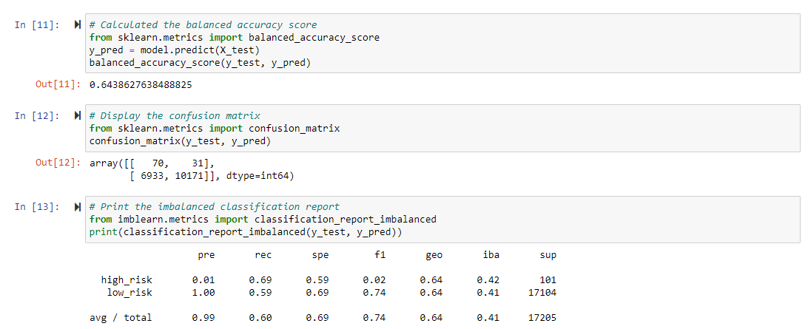
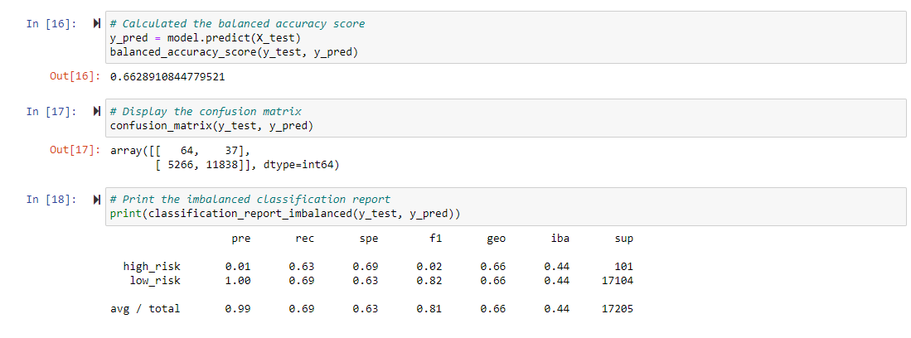
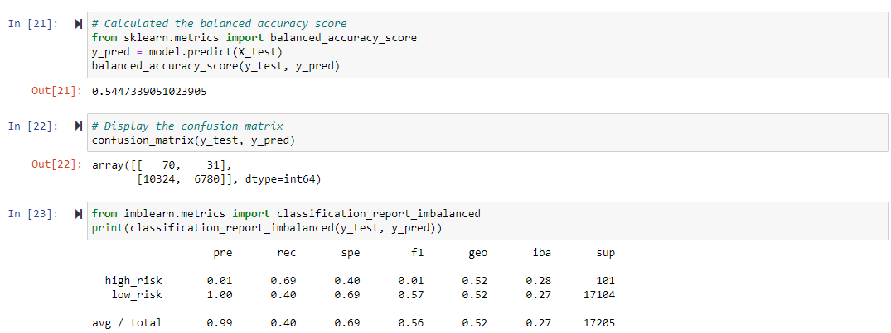
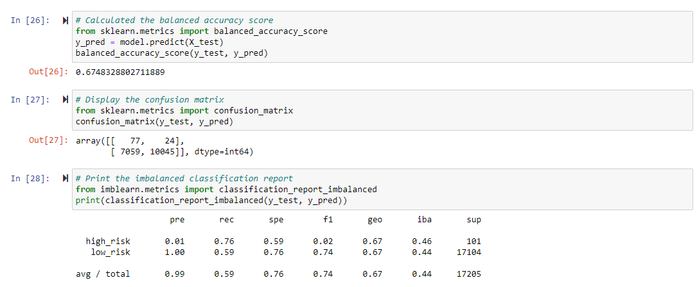
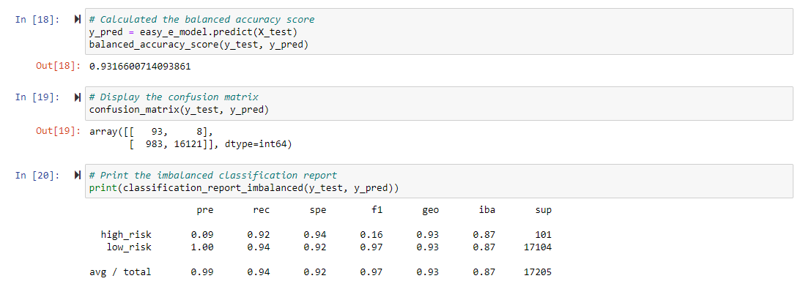
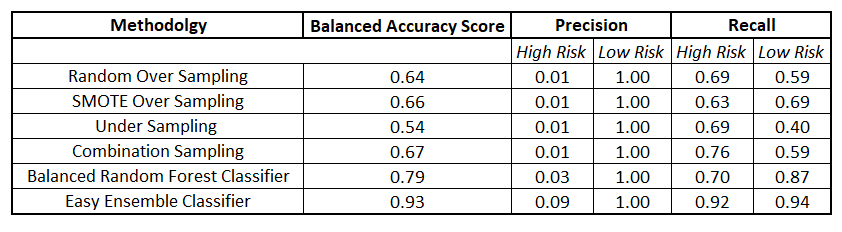

# Credit Risk Analysis 

## Overview

In this challenge we used various models and techniques to find a better way to judge the credit risk of individuals. 

## Results from Methods Used:

### Random Over Sampling

### SMOTE Over Sampling

### Under Sampling 

### Combination Sampling 

### Easy Ensemble Classifier 

## Summary 
The final conclusion that I arrived to with the summary below is that the "Easy Ensemble Classifier" method had the highest success rate in terms of BAS, precision, and recall. 

